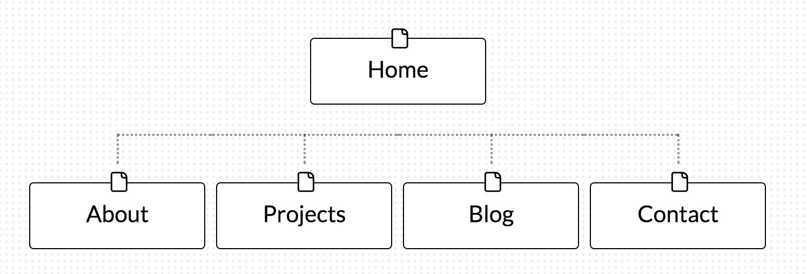

# 2.3 Introduction to Design and Site Planning

## What are the 6 Phases of Web Design?
1. Information Gathering
2. Planning
3. Design
4. Development
5. Testing and Delivery
6. Maintenance

## What is your site's primary goal or purpose? What kind of content will your site feature?
My site's primary goal is to create a visual representation of me for employers to looked at. At DBC we'll be working on a lot of projects and learning new things everyday. I want to create a place where I can display all the projects that I have worked on and the knowledge that I have gained from working on these projects. I think I'll visually display the projects on a projects page and link it to a blog post where I talk about what I gained. The blog will comprise of much more than project reflections but also difference concepts that I feel display what I've learnt.
My site will feature a general about me page to display a quick blurb about who I am and what I'm passionate about. It will also display a page for my projects and a blog. The projects will mostly be images, maybe in gallery format, linking back to a blog post. The blog page will be a continuous feed of all my blog posts, each linked to its own page. The contact page will be a short and simple way to contact me. Either information text or a quick form that links to my email.

## What is your target audience's interests and how do you see your site addressing them?
My target audience will be potential employers, more specifically ruby on rails employers. I think as an employer you would like to see visually what the candidate has to offer and what experiences they can bring to the team. My site will address this by displaying my projects and explaining the knowledge base used within each project. On top of that, I want the design of my site to include some of my skill sets. HTML and CSS will be a must, but incorporating ruby on rails would be a great touch. We haven't completed any ruby work yet, but if I could it would be beneficially for the employers to see a live example of a project that I worked on.
I also want my site to display my personality within it. I want it to be simple with simple colors to keep the focus on employers on the projects and knowledge. I'm all about learning and I want that to be evident, no glamor. 

## What is the primary "action" the user should take when coming to your site? Do you want them to search for information, contact you, or see your portfolio? It's ok to have several actions at once, or different actions for different kinds of visitors.
The primary action that the user should take when coming to my site is to view my work (projects/portfolio). I don't mind if they don't want to contact me or if they don't want to read my blog, the only thing that I want them to do is just look. I imagine that I'll have a lot of work to display by the end of DBC and I just want the user to get a feel for what projects I value. If people end of contacting me, that'll just be an added bonus. I'll be content with them just looking at my projects though.

## What are the main things someone should know about design and user experience?
First and foremost, a website's success depends on how user's perceive it. This is why UX has become so important. The old decision process of designing for the client has evolved into user-centered design. A notion that the design decisions of a site or application should revolved around the users. The user perceives a site by determining if the site gives them value, if it's easy to use, and if it's pleasant to use. Designing for the user in mind is not an easy task though. There is no one size fits all model, and you can't replicate a site from a preexisting gallery. Each site much be catered to the goals, products, and teams of the company. UX is also difficult to measure because it's all subjective. These are just a few of the main things that are important when discussing design and user experience.

## What is user experience design and why is it valuable? 
User experience is how a person feels when interacting with a system. Systems can be websites, web platforms, or mobile applications. When determining UX and how to design for the user, things like ease of use, efficiency in performance, and utility are taken into account.
UX is so valuable because a websites success depends on how users perceive a site. A great UX will compel a user to use to product more while a bad UX can push users away. Without the product being distributed/sold, your business won't be very successful. This is why user experience is essential in the design process.

## Which parts of the challenge did you find tedious?
One part of the challenge I found to be tedious was reading over the "Tasks and Techniques of UX Designers". Since UX is difficult to measure, they have many different techniques such as A/B testing to determine if changes in design really made the product better. Reading through all of the material got tedious. Nonetheless, I appreciated that they provided so many techniques to see results of something that is very difficult to measure. 