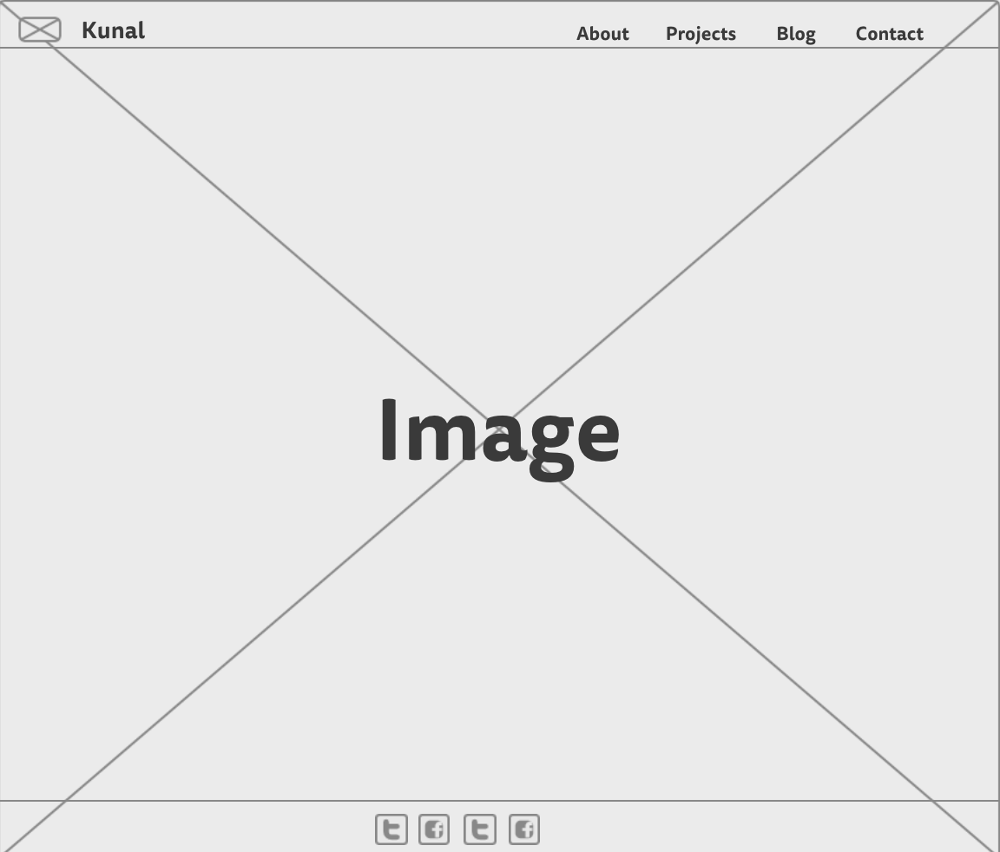
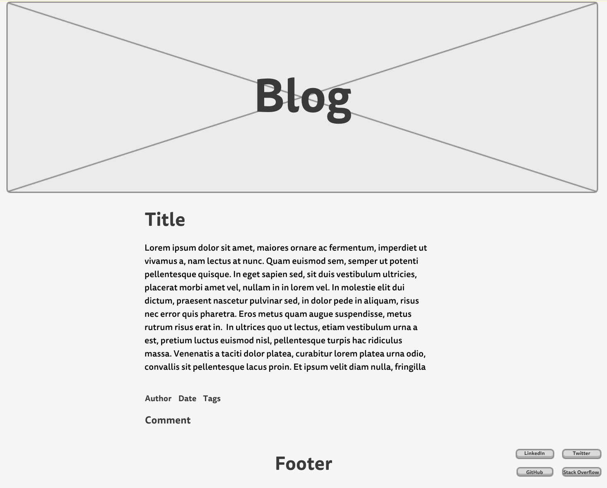

# 2.4 Wireframing

## What is a wireframe?
Wireframing is basically a website blueprint. It allows a developer to map out the websites information hierarchy, making it easier for the developer to plan the layout of a website depending on how they want the user to process the information displayed. Wireframes are mock-ups used by developers to help establish a visual for the website they will be creating. Wireframes are typically skeletons and don't contain color, images, or much text. They're very simple and are used to see how the fundamental display of the information will look. It will help the developer establish what tags to use with html to replicate the wireframe with code. The basic wireframe can be updated and details can be added such as color, images, and text to help visualize how the website will actually look once complete with html and css. 

## What are the benefits of wireframing?
There are many benefits of using wireframes when developing a website. One obvious benefit if using wireframes is that the developer can get a visual representation (a blueprint) of how the site will look before writing any code. This is important as it saves the developer time from pursuing any paths that may lead to a poorly designed website. Another benefit of wireframing is that it allows the designer to plan the layout of a website without being distracted by colors, typeface, and images. Wireframing allows the developer to see how information will be displayed on a website and how the user will interact with that interface. It leaves the colors, fonts, and images to be determined afterwards, forcing the developer to start from the bare bones of a website. One last benefit on wireframing is that it allows the developer to work with a client more efficiently to determine their preferences. The developer can work side by side with a client and get real time feedback to make changes to the wireframe according to their needs. 

## Did you enjoy wireframing your site?
I did enjoy wireframing my website but it ended up being more difficult than I imagined. Wireframing itself is an easy task but getting inspiration and being creative to develop a unique site fit to my goals was difficult. I wanted to create a site that would display my work at DBC in a style that complimented my personality of learning and growing. This was difficult as I had so many ideas that it was hard to mix and match what information layout and features would be most beneficially to my goal. I created one wireframe and then pondered on it for a while before scrapping the design and working on another wireframe. It was very difficult to settle on one and I may end up changing it again in the future. 

## Did you revise your wireframe or stick with your first idea?
As I mentioned above, I create multiple wireframes before settling on one. I looked through many personal portfolio websites that displayed the work of developers. Some were very creative while others were unoriginal. I wanted to make a wireframe for my website that would be creative and original to display my work as a develop. I also wanted to display my personal style within the website by making it very simple, allowing the user to focus on the projects within the website instead of the colors and buttons displayed on the site. Due to this requirement, I revised my wireframe multiple times to make it less feature-based and more simplistic. 

## What questions did you ask during this challenge? What resources did you find to help you answer them?
I had a few questions when completing this challenge. When creating my wireframe I wondered how complex my wireframe had to be. Did I have to include a lot of information to display that I reviewed the material and knew how to create a wireframe? In the end, I completed the wireframe according to how I wanted users to process my information and not how much I knew about wireframes. Another question I had what if it was required to use a header and footer in all wireframes. I wanted my website layout to be very simple, and chose to forgo the header and footer on the index of the site. After they user clicked on another link, the header and footer would be displayed, but I wanted to keep the index very basic. Besides the resources provided on the week-2 module, I didn't use any external resources. To wireframe my website and blog, I used mockingbird as it was a free web application. It was easy to use and provided me with the elements I needed to create my wireframe. 

## Which parts of the challenge did you enjoy and which parts did you find tedious?
I liked working with the command line. Two weeks in and the command line is getting easier and I can see how the graphical user interface works compared to the command line. I also enjoyed creating my wireframes although it was a long process. The reading was bit tedious learning about all of the wireframing tools and steps but it was essential for me to eventually create my wireframe. Although it was boring at times, the reading provided me with a list of resources that I could use as well as some inspiration in creating my wireframe. Overall, it was a great challenge to introduce the concept and benefits of wireframing. 