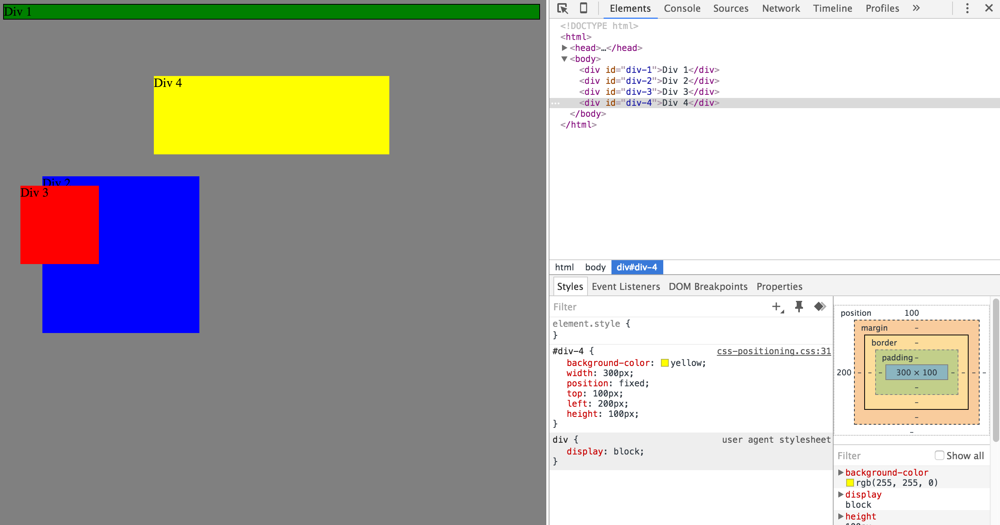
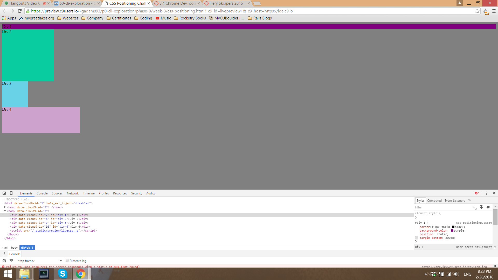
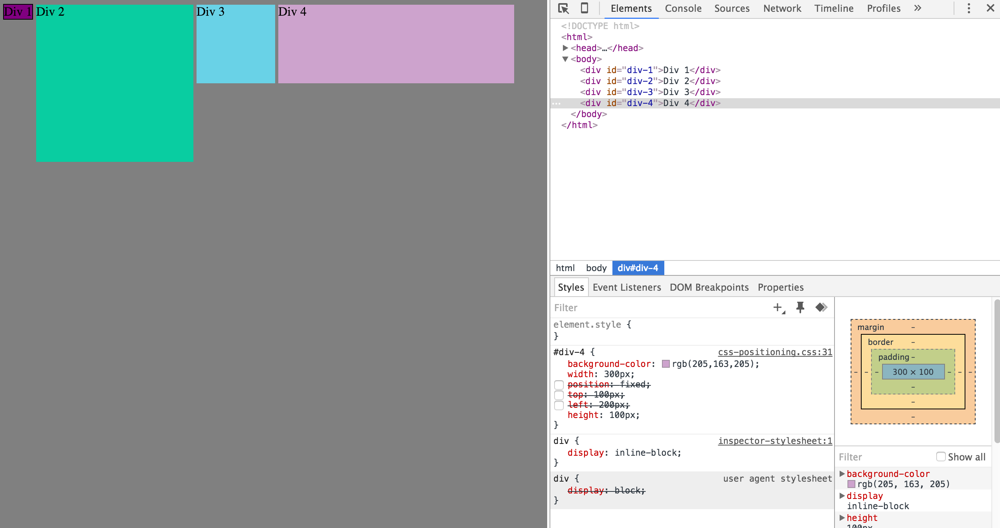
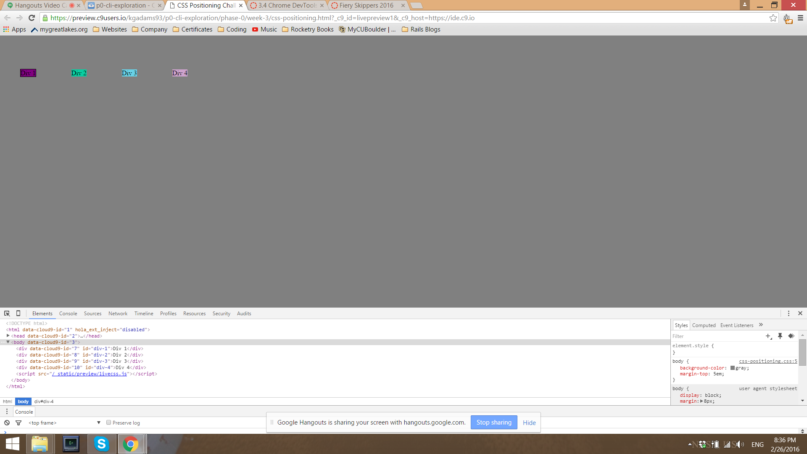
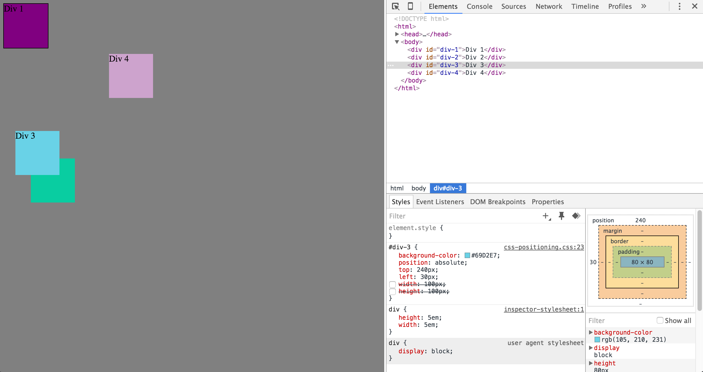
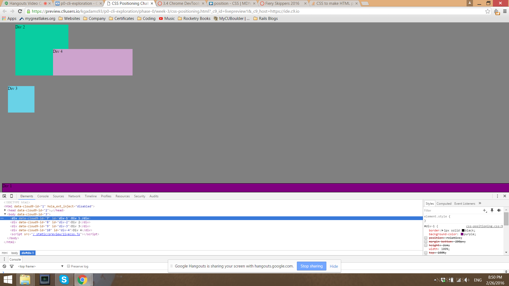
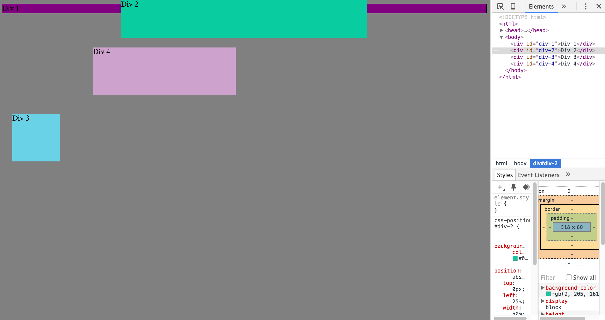
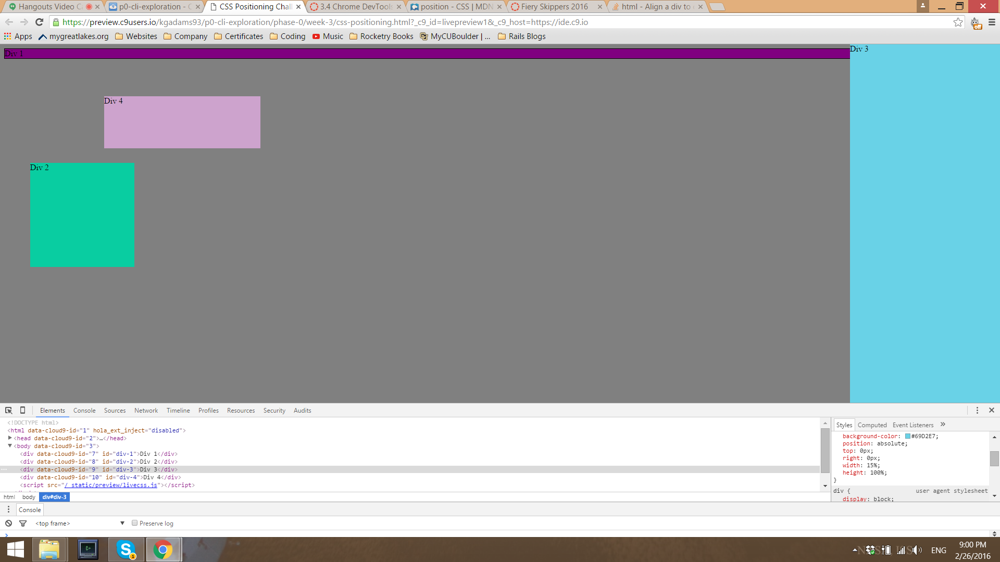
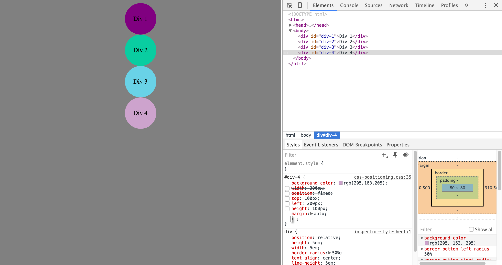

# 3.4 Chrome DevTools

## How can you use Chrome's DevTools inspector to help you format or position elements?

Chrome DevTools is a essential tool in the Developers toolbox for debugging. As a beginner to HTML and CSS, I learn a lot about structures and styling by viewing preexisting code of well designed sites. DevTools allows me to inspect the HTML and CSS of any website instantly. Not only does it display the HTML and CSS code, but it allows you to alter the code and view the changes in real time. This increases efficiently, as a developer doesn't have to change the HTML/CSS on a editor and open the page in the browser each time after making changes. Another great feature on DevTools is that it allows you to hover over the elements and get a detailed account of the styling put on that element. The styling includes all format alterations as well as changes in position. A very useful display is the margin, border, padding, context map on the DevTools interface. The map allows a developer to view the margins, border, padding, and context of an element and make changes to alter the element directly with DevTools. This is obviously beneficially developer as they can make changes in real time to get a sense of what exact values that need to input on their HTML/CSS pages on their editors. It also allows you to debug code as DevTools helps you identify hierarchy and styling that doesn't function property with the code. Overall, DevTools is an essential tool in the process of building a website. 

## How can you resize elements on the DOM using CSS?

I believe there are several ways to resize elements on the DOM. While researching I found a few methods such as utilizing the resize and overflow properties to resize elements. For this challenge, we used the height and width properties to resize the elements (boxes) into the desired size. This property is very simply and resizes elements to the pixel value that you specify along with the property. 

## What are the differences between absolute, fixed, static, and relative positioning? Which did you find easiest to use? Which was most difficult?

Static positioning is the same as the normal flow of the elements. Using the position: static will render the element in a normal flow in the page. Positioning elements using static will also negate them from being effected by any of the top, bottom, left, right properties. Relative positioning is the property that utilizes the top, bottom, left, right properties. Using position: relative will adjust the position of the element depending on the values the develop inputs into the top, bottom, left, right properties. The fixed position is based on the users viewpoint. It uses the top, bottom, left, right properties to position itself on the page and it is fixed there. This means that no matter where the user scrolls on the page, that element will be fixed/stuck at that location. Finally, absolute positioning is positioning that is based on the nearest "ancestor". This means that element positions itself relative to the ancestor element instead of relative to the body of the page. It utilizes the top, bottom, left, right properties to move it around relative to the ancestor element. 
The easiest position to use is static. This is because it is very basic and requires the least amount of styling. It adheres to the normal flow structure and doesn't require additional property inputs. The most difficult position to use would be absolute. The whole concept of positioning in relation to the ancestor element as opposed to the body is a bit more complex. It requires much more thought to correctly position it in accordance with the surrounding elements. 

## What are the differences between margin, border, and padding?

At first these three properties seemed complex to me. As I experimented with DevTools and CSS more and more, they were easy to understand. One visual that helped me was the margin, border, padding, context map in DevTools. It gives you a great visualization of each elements margin, border, and padding when hovering over the box. The margin is the area outside the border and it's transparent. It allows elements to distance themselves from other elements depending on specifications. You can alter the margin property with one value to specify changes to all the margins, or you can use margin-top, margin-bottom, margin-left, and margin-right to specify changes to one specific side of the element. The border is the styling that goes around the padding and content. The border needs to be given a value of a pixel size (for thickness), a border style (solid), and a color (black). It allows your context and padding to be surrounded by a box. The padding is a transparent area in between the context and border. Padding is useful for providing space between your context and the border that you create. Similar to margin, you can use select properties to specify padding sizes on each side of the content. Setting one value for padding will allow the element to be padding on every side with that specific value. These are just the general differences between these three properties. 

## What was your impression of this challenge overall? (love, hate, and why?)

I really liked this challenge. Before this challenge, I had opened up DevTools a few times but I never knew how to utilize it. Throughout this challenge, while solving each problem, I gained experience and developed a general knowledge base of how to effectively utilize DevTools. I think of it as a science lab to experiment on websites. Instead of downloading code and opening up local files in the web browser, DevTools allows me to directly make and view changes on Chrome. Each problem that we encountered forced us to experiment with the CSS styling to find the correct solution. Through this process of experimentation we learned about other styling choices and how they effected the elements on the page. I also believe the enthusiasm my pair and I both had towards solving each problem also contributed to me enjoying this challenge. Overall, it was a great challenge to allow us to learn about Chrome DevTools in a unique way.
