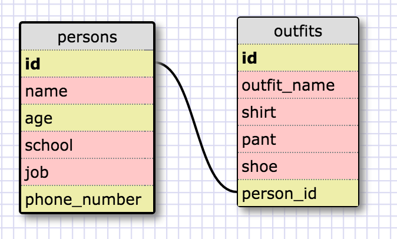

# 8.4 Introduction to Database Schemas and SQL

## Release 5: SELECTing data from a database

1. Select all data for all states.

SELECT * FROM states;

2. Select all data for all regions.

SELECT * FROM regions;

3. Select the state_name and population for all states.

SELECT state_name, population FROM states;

4. Select the state_name and population for all states ordered by population. The state with the highest population should be at the top.

SELECT state_name, population
FROM states
ORDER BY population DESC;

5. Select the state_name for the states in region 7.

SELECT state_name
FROM states
WHERE region_id = 7;

6. Select the state\_name and population_density for states with a population density over 50 ordered from least to most dense.

SELECT state\_name, population_density
FROM states
WHERE population_density > 50
ORDER BY population_density ASC;

7. Select the state_name for states with a population between 1 million and 1.5 million people.

SELECT state_name
FROM states
WHERE population > 1000000
AND population < 1500000;

8. Select the state\_name and region_id for states ordered by region in ascending order.

SELECT state\_name, region_id
FROM states
ORDER BY region_id ASC;

9. Select the region_name for the regions with "Central" in the name.

SELECT DISTINCT region_name
FROM regions
WHERE region_name LIKE '%Central%';

10. Select the region\_name and the state\_name for all states and regions in ascending order by region_id. Refer to the region by name. (This will involve joining the tables).

SELECT regions.region\_name, states.state_name
FROM regions
INNER JOIN states
ON regions.id=states.region_id
ORDER BY region_id ASC;

## Release 6: Your Own Schema

## Release 7: Reflect

1. What are databases for?

Databases are used to store a lot of data. In previous weeks, we used hashes and arrays to store data. The problem with this is that it is hard to access and insert data into these structures. Databases make it easy to store and retrieve a lot of data. For example, the "hashy hash" database was easier to manipulate using sqlite3 as opposed to when we used ruby and Javascript to manipulate its contents.

2. What is a one-to-many relationship?

A one to many relationship is when one instance in a database can be paired with many instances in another database. In this challenge, they provided the example people and cars. In the database, cars were associated with people. A person could have owned 1 car, or many cars. In this way, the one-to-many relationship identifies that one person (instance) could be associated and connect with multiple cars in another table.

3. What is a primary key? What is a foreign key? How can you determine which is which?

A primary key is the unique key for that table. That specific table will not have two identical primary keys as this is the field that is used to differentiate each instance in the table. A foreign key is the primary key of another table. It is used to connect data between tables. Although a primary key only appears once in the table, a foreign key can appear multiple times within the table. It is used pair and associate instances together form multiple tables. 

4. How can you select information out of a SQL database? What are some general guidelines for that?

Selecting information out of a SQL database is simple. You use SELECT followed by the column\_name followed by FROM and the table_name. After each query must end with a semi-colon. These are the basic statements to access data. Statements such as Distinct, Where, Order By, and Join allow you to manipulate and order the database in much more depth. 
