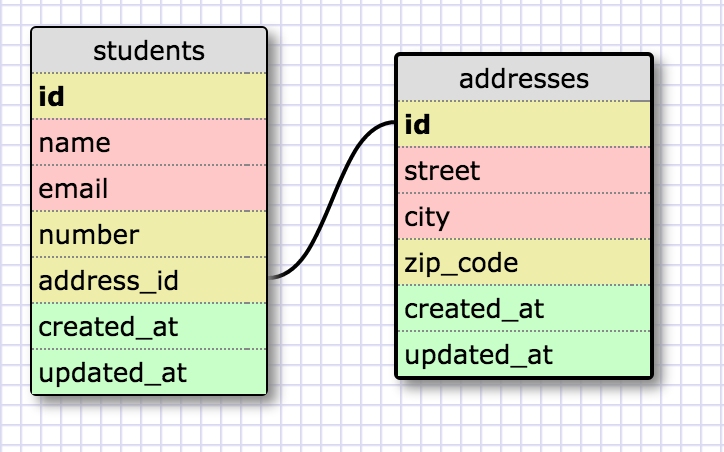

# 8.5 More Schemas

## One-to-one Relationship

A one-to-one relationship is when two tables are associated with each other based on one matching row. In our example, we have a relationship between the students table and the addresses table. Each address can belong to only one student, meaning it is a one-to-one relationship. The address_id field in the students table refers to the matching record in the address table. This is known as a "foreign key".

## Many-to-Many Relationship

The many-to-many relationship is when two tables are associated with each other based on multiple matching rows. The first table can map to multiple rows in the second table, and the rows in the second table can also map to multiple rows in the first table. In our example, we have grocery\_lists table and a items table. A grocery list can have multiple items, and items can belong to multiple grocery lists. In the way, the relationship between the two tables is many-to-many. These two tables can be joined together in the grocery\_list\_items table through the grocery_lists foreign key & the items foreign key.

## Reflection

- What is a one-to-one database?

A one-to-one relationship is when each row in one database table is linked to 1 and only 1 other row in another table.

- When would you use a one-to-one database? (Think generally, not in terms of the example you created).

A one-to-one database would be used when each row in Table A is linked to another row in Table B. The number of rows in Table A must equal the number of rows in Table B. For example, each row in a customer name table would be related to 1 and only 1 other row in the customer details table. Similarly, each row in the customer details table is related to 1 and only 1 other row in the customer name table. One-to-one relationships are best utilized when columns are rarely used and it makes sense to separate them out into separate database tables linked to the original table.

- What is a many-to-many database?

The many-to-many relationship is when one or more rows in a table can be related to 0, 1, or many rows in another table.

- When would you use a many-to-many database? (Think generally, not in terms of the example you created).

A many-to-many relationship would be used when each row in Table A is linked to 0, 1, or many rows in Table B and vice versa. In many-to-many relationships, a 3rd table called a mapping table is required in order to implement the relationship.

- What is confusing about database schemas? What makes sense?

The confusing part of database schemas is how to correctly identify the relationship in which you want to organize the data. Data that we want to utilize and manipulate can be organized into many different tables and connecting them through these relationships can be confusing. The relationships themselves make sense. Connecting the tables depending on the number of rows that correlate would determine the relationship that would be utilized for the tables.
